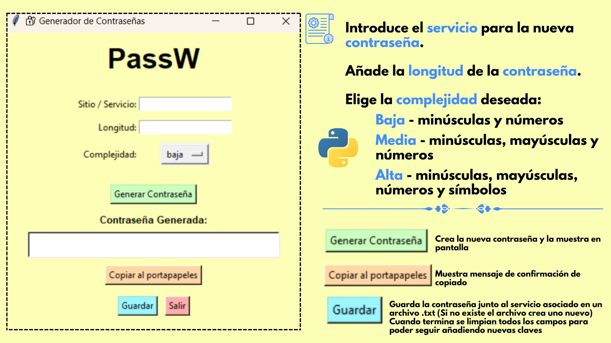

# 🔐 PassW - Generador de Contraseñas

Una pequeña aplicación en Python con interfaz gráfica hecha con `tkinter` que genera contraseñas seguras según el nivel de complejidad deseado. Además, te permite guardar las contraseñas generadas para tus sitios web o servicios.



## ✨ Características

- Generación de contraseñas con diferentes niveles de complejidad (baja, media, alta)
- Interfaz sencilla 
- Guarda las contraseñas en un archivo `.txt` con formato legible
- Copia rápida al portapapeles
- No necesita dependencias externas

## 🛠️ Tecnologías utilizadas

- Python 3.x
- Tkinter (interfaz gráfica)
- Librería estándar (`string`, `random`, `json`)

## 🚀 Cómo ejecutar

1. Clona este repositorio:
   ```bash
   
   git clone https://github.com/tu_usuario/passW.git
   cd passW

´´´

2. Crea un entorno virtual:
```bash

python -m venv venv
source venv/bin/activate  # En Linux/macOS
venv\Scripts\activate     # En Windows

```

3. Ejecuta la App

 ```bash
   
   python main.py

```

## 📁 Estructura del proyecto

 passW/
│
├── main.py
├── contrasenas.txt
├── README.md
├── .gitignore
└── captura.jpg


## 🛠️ Contribuir

Si quieres mejorar este proyecto haz un fork del repositorio, crea una nueva rama y envía un pull request con tus mejoras. 😃

💡 Autor

Nacho Naves

GitHub: @MitoNacho

Web personal: https://mitonacho.github.io/dev/


